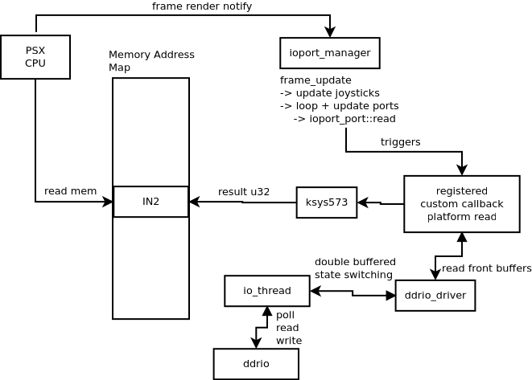

# ksys573 driver notes about how IO works
Personal notes taken while researching how IO works in MAME and how the game calls various things
in order to figure out how I have to change stuff.

## ksys573 emulation: How inputs are read and outputs written for DDRIO
This outlines the relevant building blocks that I had to figure out to understand how the game
handles IO especially reading from the registers to get inputs from the platforms and setting the
outputs for the various lights. Furthermore, this touches upon the relevant emulation backend parts
of MAME for IO handling.



Key aspects outlined in the above figure:
* IO is memory mapped
* MAME's `ioport_manager` is triggered to update when frames are rendered
* `ioport_manager` updates joysticks and calls custom callbacks attached to defined `ioport_port`
objects
* Update the memory mapped registers for inputs with data from the `ddrio_driver` backend
* `ddrio_driver` backend is not polling synchronously as this would be driven by the main render
thread introducing high latency
* A separate `io_thread` in `ddrio_driver` drives the connected `ddrio` device asynchronously
* States are double buffered with back buffers being updated by driver thread and front buffers
read by IO callbacks
* Low latency buffer swaps are triggered on `ioport_port` callbacks

## Call analysis of inputs and outputs, ksys573 module
### Read input calls for reading pad input
* 4th Mix Plus (30 FPS for drawing during gameplay): 150 fps during gameplay
* Extreme: (60 FPS for drawing during gameplay): 180 fps during gameplay

Ultimately, this callback is trigered when the machine/CPU triggers a frame render notification
However, it doesn't sync up 1:1 with vblank but rather 2:1 -> 2 vblanks followed by 1 input poll

Debug output with debug prints added to relevant functions of the code visualizing the call pattern.
```text
>>> input
>>> vblank
>>> input
>>> vblank
>>> input
>>>> output: 15 = 1
stage: 2p data clk=1 state=0 d0=0 shift=00000000 bit=0 stage_mask=ffffffff
>>>> output: 7 = 1
stage: 1p data clk=1 state=0 d0=0 shift=00000000 bit=0 stage_mask=ffffffff
>>> input
>>> vblank
>>> input
>>> vblank
>>> input
>>>> output: 15 = 0
stage: 2p data clk=0 state=0 d0=0 shift=00000000 bit=0 stage_mask=ffffffff
>>>> output: 7 = 0
stage: 1p data clk=0 state=0 d0=0 shift=00000000 bit=0 stage_mask=ffffffff
```